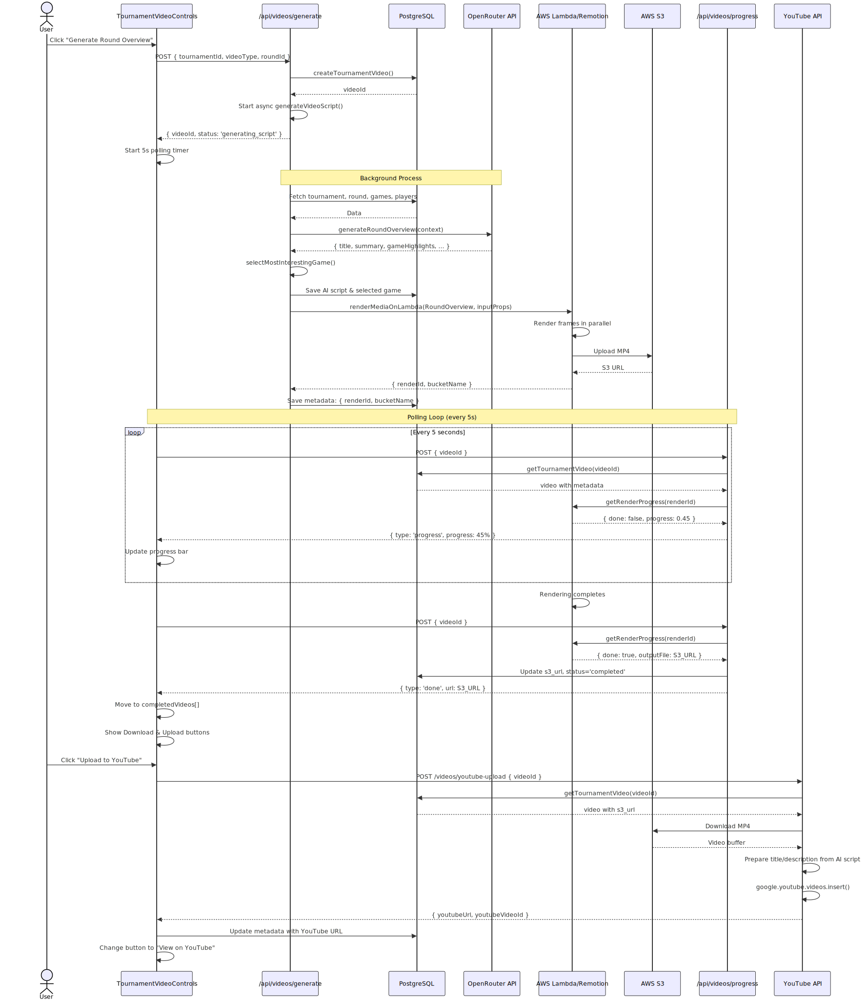

# Tournament Video Rendering Architecture

This document describes the data flow and architecture for tournament video generation and rendering.

## Overview

The tournament video system generates AI-powered video summaries of chess tournaments, including:
- **Tournament Overview**: Complete 2-3 minute summary of entire tournament
- **Round Overview**: Detailed analysis of a specific round
- **Player Overview**: Performance analysis for individual players

## Architecture Diagrams

### 1. Complete Data Flow


**File**: `tournament-video-flow.mmd` / `tournament-video-flow.svg`

This comprehensive flowchart shows the entire process from user interaction through video completion:
- User interface interaction
- API request handling and authentication
- Background AI script generation with OpenRouter
- Lambda rendering with Remotion
- Progress polling mechanism
- Video completion and YouTube upload

**Key Subgraphs**:
- **Background Process**: AI script generation with OpenRouter API
- **triggerLambdaRender**: Lambda preparation and invocation
- **AWS Lambda**: Remotion rendering pipeline
- **Progress Polling**: 5-second polling loop with status updates
- **Video Completion**: Download and YouTube upload options
- **Database Operations**: Key database functions and schema

### 2. Sequence Diagram


**File**: `tournament-video-sequence.mmd` / `tournament-video-sequence.svg`

This sequence diagram shows the timeline of interactions between components:
- User → UI → API flow
- Async background processing
- Database operations at each step
- AI generation with OpenRouter
- Lambda rendering lifecycle
- Polling loop behavior (every 5 seconds)
- YouTube upload process

**Participants**:
- User (actor)
- TournamentVideoControls (React component)
- /api/videos/generate (API endpoint)
- PostgreSQL database
- OpenRouter AI API
- AWS Lambda/Remotion
- AWS S3
- /api/videos/progress (polling endpoint)
- YouTube API

### 3. State Machine


**File**: `tournament-video-states.mmd` / `tournament-video-states.svg`

This state diagram shows the lifecycle of a tournament video record:

**States**:
1. **pending**: Initial state after `createTournamentVideo()`
2. **generating_script**: AI script generation in progress (OpenRouter API call)
3. **rendering**: Video rendering on Lambda (0-100% progress)
4. **completed**: Video ready with S3 URL
5. **failed**: Error occurred during generation or rendering

**Transitions**:
- `pending` → `generating_script`: Background process starts
- `generating_script` → `rendering`: AI script saved, Lambda triggered
- `generating_script` → `failed`: AI generation error
- `rendering` → `completed`: Video uploaded to S3
- `rendering` → `failed`: Lambda render error
- `completed` → `completed`: YouTube upload (metadata updated)

**Database Fields per State**:
- **pending**: `status='pending'`, no AI script
- **generating_script**: `status='generating_script'`, calling OpenRouter
- **rendering**: `status='rendering'`, `metadata: { renderId, bucketName }`
- **completed**: `status='completed'`, `s3_url` populated
- **failed**: `status='failed'`, `error` message populated

## Key Components

### API Endpoints

#### POST /api/tournaments/videos/generate
- Creates video record
- Triggers async AI script generation
- Returns immediately with `videoId` and `status='generating_script'`

#### POST /api/tournaments/videos/progress
- Polls Lambda for render progress
- Updates database with S3 URL when complete
- Returns progress (0-1) or completion status

#### GET /api/tournaments/videos/generate
- Lists all videos for a tournament
- Filters by `status='completed'` for display

#### POST /api/tournaments/videos/youtube-upload
- Downloads video from S3
- Uploads to YouTube with AI-generated metadata
- Updates database with YouTube URL

### Database Schema

**Table**: `tournament_videos`

```sql
CREATE TABLE tournament_videos (
  id UUID PRIMARY KEY,
  user_id TEXT NOT NULL,
  tournament_id UUID NOT NULL,
  video_type TEXT NOT NULL, -- 'tournament_overview', 'round_overview', 'player_overview'
  round_id UUID,            -- For round overview videos
  player_fide_id TEXT,      -- For player overview videos
  status TEXT NOT NULL,     -- 'pending', 'generating_script', 'rendering', 'completed', 'failed'
  s3_url TEXT,              -- Final video URL
  ai_script JSONB,          -- AI-generated content (title, summary, highlights, etc.)
  selected_game_id UUID,    -- Featured game for the video
  metadata JSONB,           -- { renderId, bucketName, youtubeUrl, etc. }
  start_time TIMESTAMP,
  end_time TIMESTAMP,
  error TEXT,
  created_at TIMESTAMP,
  updated_at TIMESTAMP
);
```

### AI Script Generation

**Service**: `src/lib/tournament-ai.ts`

Uses OpenRouter API (gpt-4o-mini) to generate narratives:

- **generateTournamentOverview**: Creates overview with title, summary, highlights, round summaries, conclusion
- **generateRoundOverview**: Creates round analysis with game highlights and standings narrative
- **generatePlayerOverview**: Creates player profile with performance analysis, best/worst games

### Remotion Compositions

**Compositions**:
1. **TournamentOverview** (`src/remotion/TournamentVideo/TournamentOverview.tsx`)
   - Duration: ~2-3 minutes
   - Includes: Intro, title, summary, highlights, rounds, standings, featured game, conclusion, outro

2. **RoundOverview** (`src/remotion/TournamentVideo/RoundOverview.tsx`)
   - Duration: ~1.5 minutes
   - Includes: Intro, title, summary, game highlights, standings, narrative, featured game, outro

3. **PlayerOverview** (`src/remotion/TournamentVideo/PlayerOverview.tsx`)
   - Duration: ~1.7 minutes
   - Includes: Intro, title, introduction, performance summary, best game, disappointing games, featured game, conclusion, outro

**Reusable Components**:
- `NarrativeSlide`: Text content with fade-in/slide-up animations
- `HighlightsSlide`: Bulleted list with animations
- `StandingsSlide`: Player rankings table
- `ChessGameWalkthrough`: Animated chess game playback

## Data Flow Summary

1. **User Request** → API creates video record, triggers background process
2. **Background** → AI generates script, selects featured game, triggers Lambda
3. **Lambda** → Renders video in parallel, uploads to S3, returns render ID
4. **Polling** → Frontend polls every 5s, updates progress, detects completion
5. **Completion** → Video available for download and YouTube upload

## Technologies Used

- **Frontend**: React, Next.js 15, TypeScript
- **Backend**: Next.js API Routes, Clerk authentication
- **Database**: PostgreSQL with JSONB columns
- **AI**: OpenRouter API (gpt-4o-mini)
- **Video Rendering**: Remotion, AWS Lambda
- **Storage**: AWS S3
- **Upload**: YouTube Data API v3

## Regenerating Diagrams

To regenerate the SVG files from the Mermaid source:

```bash
# Install mermaid-cli (if not already installed)
npm install -g @mermaid-js/mermaid-cli

# Or use npx (no installation required)
npx -p @mermaid-js/mermaid-cli mmdc -i docs/tournament-video-flow.mmd -o docs/tournament-video-flow.svg -b transparent
npx -p @mermaid-js/mermaid-cli mmdc -i docs/tournament-video-sequence.mmd -o docs/tournament-video-sequence.svg -b transparent
npx -p @mermaid-js/mermaid-cli mmdc -i docs/tournament-video-states.mmd -o docs/tournament-video-states.svg -b transparent
```

## Notes

- Videos render asynchronously to avoid blocking the UI
- Progress updates every 5 seconds during rendering
- Lambda renders frames in parallel across multiple instances (~100 frames per instance)
- YouTube uploads use unlisted privacy setting by default
- AI-generated content is stored in JSONB for flexibility
- S3 URLs are direct video links (not in metadata)
